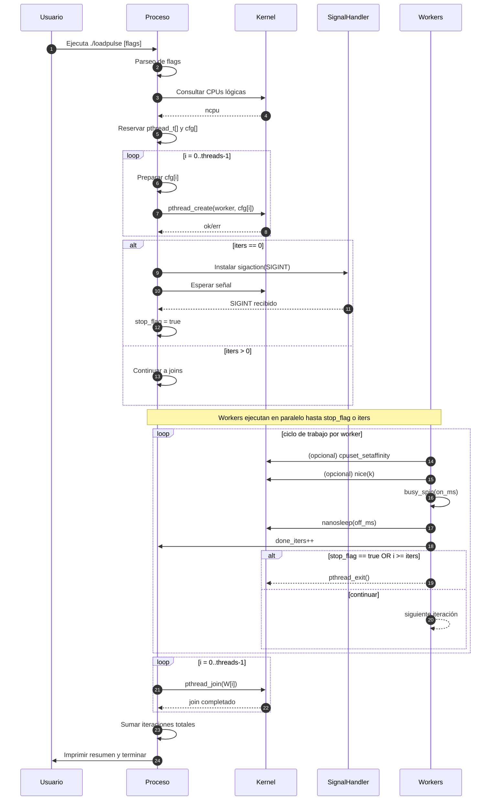
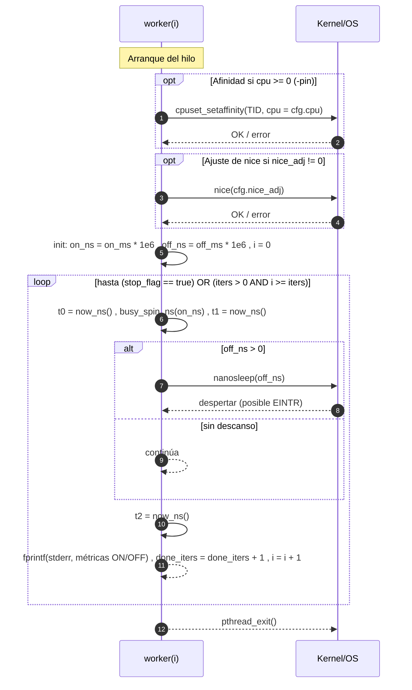

# `loadpulse` — Generador de carga en ráfagas (CPU-on / sleep-off)

Pequeña utilidad en C para simular trabajo en ráfagas: cada hilo “quema CPU” durante `on_ms` y luego duerme `off_ms`. Soporta **afinidad por CPU** (FreeBSD `cpuset(2)`) y **ajuste de nice** por hilo. Útil para probar *schedulers*, termodinámica de CPU, *governors*, colas de ejecución, etc.

## Compilación

FreeBSD (recomendado):

```sh
cc -O2 -pthread loadpulse.c -o loadpulse
```

> Requiere: `pthread`, `cpuset(2)`, `sysctlbyname(3)`.

Linux (portándolo rápido): compila, pero la afinidad y `pthread_getthreadid_np()` cambian (ver **Notas de portabilidad**).

## Uso

```text
Uso: loadpulse [-t hilos] [-on ms] [-off ms] [-iters N] [-pin] [-nice k]
  -t      número de hilos (por defecto 4)
  -on     milisegundos de ráfaga activa (CPU) (por defecto 50)
  -off    milisegundos de descanso (sleep) (por defecto 50)
  -iters  iteraciones por hilo (0=infinito, por defecto 0)
  -pin    fija afinidad: asigna hilos round-robin a CPUs lógicas
  -nice   ajusta nice por hilo (p.ej. -5 o +10)
```

### Ejemplos

- 8 hilos, 3:1 duty-cycle (75% on):  
  `./loadpulse -t 8 -on 75 -off 25`

- Afinar por CPU y bajar prioridad:  
  `./loadpulse -t 4 -on 40 -off 60 -pin -nice 5`

- 2 hilos, 100 iteraciones y sin descanso (100% on):  
  `./loadpulse -t 2 -on 10 -off 0 -iters 100`

## Qué hace internamente

1. **Parseo de flags** y descubrimiento de CPUs lógicas (`hw.ncpu`).
2. **Creación de hilos** con configuración (`id`, `cpu`, `on_ms`, `off_ms`, `iters`, `nice`).
3. Por hilo:
   - (Opcional) **Afinidad** vía `cpuset_setaffinity()` si `-pin`.
   - (Opcional) **nice** por hilo si `-nice`.
   - Bucle de trabajo:
     - **ON**: *busy-spin* con precisión de *wall clock* (`CLOCK_MONOTONIC`) durante `on_ms`.
     - **OFF**: `nanosleep()` durante `off_ms` (si `> 0`).
     - **Log** de métricas por iteración a `stderr`.
4. **Finalización / graceful stop**: si `-iters 0`, el proceso espera señal externa y al recibir `SIGINT` pide terminar a los hilos y resume iteraciones completadas.

### Diagrama de secuencia (general)



### Diagrama de secuencia (por Hilo)



## Métricas que imprime

Por iteración y por hilo a `stderr`:

```
thr=<id> iter=<i> on_ms=<cfg> off_ms=<cfg> dur_on=<medido_ms> dur_off=<medido_ms>
```

- `dur_on` ≈ tiempo real de *busy-spin*.
- `dur_off` ≈ tiempo real de sueño (puede ser > `off_ms` por *scheduling*, *tick*, *EINTR*).

## Rendimiento y exactitud

- **Spin ON**: consume 100% de la CPU lógica asignada; útil para probar *preemption* y contención.
- **Sleep OFF**: `nanosleep()` puede *despertar tarde* según *tick*, *C-states* y carga del sistema.
- **Afinidad (`-pin`)**: reduce migraciones y ruido; ideal para comparar *cores*.
- **Log**: el `fprintf(stderr, ...)` por iteración introduce overhead; si medís fino, desactivá o muestreá.

## Notas de portabilidad / fixes recomendados

> El código está orientado a FreeBSD. Para dejarlo redondo:

- **Includes**: agregar `#include <inttypes.h>` (por `PRIu64`) y `#include <signal.h>`.
- **`stop_flag`**: declarar como `static _Atomic bool stop_flag = false;`.
- **Descubrimiento de CPU**: elegí **uno** (no ambos). En FreeBSD ya usás:
  ```c
  int ncpu = 1; size_t sz = sizeof(ncpu);
  sysctlbyname("hw.ncpu", &ncpu, &sz, NULL, 0);
  ```
  (Si vas a usar `sysconf(_SC_NPROCESSORS_ONLN)`, hacelo bajo `#ifdef __linux__`.)
- **TID en FreeBSD**: `pthread_getthreadid_np()` está bien; en Linux usarías `syscall(SYS_gettid)` o `pthread_self()` + `pthread_setaffinity_np`.
- **Afinidad Linux**: reemplazar `cpuset_setaffinity(...)` por `pthread_setaffinity_np(...)` con `cpu_set_t`.
- **Señales**: no ignores `SIGINT`. Mejor:
  ```c
  static _Atomic bool stop_flag = false;

  static void on_sigint(int){ atomic_store(&stop_flag, true); }

  int main(...) {
      struct sigaction sa = {0};
      sa.sa_handler = on_sigint;
      sigaction(SIGINT, &sa, NULL);
      ...
  }
  ```
- **Medición**: si necesitás *high-resolution sleep* en Linux, evaluar `clock_nanosleep(CLOCK_MONOTONIC, 0, ...)`.

## Salida de resumen

Al terminar, imprime un conteo agregado de iteraciones completadas por todos los hilos.

---


## Build con Makefile

Este repo incluye un `Makefile` (FreeBSD‑friendly / POSIX).

```make
# Targets principales
make         # build release (por defecto, -O2 -pipe)
make debug   # build con -O0 -g
make asan    # build con sanitizers (clang)
make run     # ejecuta con RUNOPTS (por defecto: -t 4 -on 80 -off 20 -pin)
make install # instala en $(PREFIX)/bin (default /usr/local/bin)
make clean   # limpia
```

Variables clave (override desde CLI si querés):
- `CC` (default: `cc`)
- `TARGET` = `loadpulse`
- `SRC` = `loadpulse.c`
- `RUNOPTS` (default: `-t 4 -on 80 -off 20 -pin`)

Ejemplos:

```sh
make
./loadpulse -t 8 -on 75 -off 25

make debug
./loadpulse -t 2 -on 10 -off 0 -iters 200

make RUNOPTS="-t 6 -on 40 -off 60 -nice 5 -pin" run
```

---

## Uso del binario

```
Uso: loadpulse [-t hilos] [-on ms] [-off ms] [-iters N] [-pin] [-nice k]
  -t      número de hilos (por defecto 4)
  -on     milisegundos de ráfaga activa (CPU) (por defecto 50)
  -off    milisegundos de descanso (sleep) (por defecto 50)
  -iters  iteraciones por hilo (0=infinito, por defecto 0)
  -pin    fija afinidad: asigna hilos round-robin a CPUs lógicas
  -nice   ajusta nice por hilo (p.ej. -5 o +10)
```

Salida por iteración (a `stderr`):

```
thr=<id> iter=<i> on_ms=<cfg> off_ms=<cfg> dur_on=<medido_ms> dur_off=<medido_ms>
```

- `dur_on`: tiempo real de *busy-spin* (wall clock, `CLOCK_MONOTONIC`).
- `dur_off`: tiempo real de sueño (puede ser > `off_ms` por *scheduling*, *tick*, *EINTR*).

---

## Qué hace internamente

1. **Parseo de flags** y descubrimiento de CPUs lógicas (`hw.ncpu` en FreeBSD).
2. **Creación de hilos** con config (`id`, `cpu`, `on_ms`, `off_ms`, `iters`, `nice`).
3. Por hilo:
   - (Opcional) **Afinidad** con `cpuset_setaffinity()` si `-pin` (round‑robin).
   - (Opcional) **nice** por hilo con `nice()` si `-nice`.
   - Bucle de trabajo:
     - **ON**: *busy-spin* durante `on_ms`.
     - **OFF**: `nanosleep()` durante `off_ms` (si `> 0`).
     - **Log** de métricas y contador de iteraciones.
4. **Finalización**: si `-iters 0`, espera señal externa; al recibir `SIGINT` finaliza limpiamente y muestra un resumen global de iteraciones.


---

## Notas de portabilidad / fixes recomendados

> Código orientado a FreeBSD; sugerencias para pulir y portar.

- **Includes**: asegurá `#include <inttypes.h>` (por `PRIu64`) y `#include <signal.h>`.
- **`stop_flag`**: declarar `static _Atomic bool stop_flag = false;` y manejar `SIGINT` con `sigaction` para *graceful stop*.
- **CPUs lógicas**: usá **uno** de los métodos. En FreeBSD:
  ```c
  int ncpu = 1; size_t sz = sizeof(ncpu);
  sysctlbyname("hw.ncpu", &ncpu, &sz, NULL, 0);
  ```
  En Linux: `int ncpu = sysconf(_SC_NPROCESSORS_ONLN);` con `#ifdef __linux__`.
- **Afinidad Linux**: `pthread_setaffinity_np()` con `cpu_set_t` en vez de `cpuset_setaffinity()`.
- **TID**: FreeBSD `pthread_getthreadid_np()`; Linux `syscall(SYS_gettid)` o `pthread_self()`.
- **Precisión de sleep (Linux)**: evaluar `clock_nanosleep(CLOCK_MONOTONIC, 0, ...)`.

---

## Seguridad / impacto

Este programa **genera carga real** y puede calentar el equipo y afectar otros procesos. En servidores compartidos, evitá `-on` altos con `-off` bajos y preferí `-nice` positivo.

---

## Licencia

MIT (o la que prefieras).